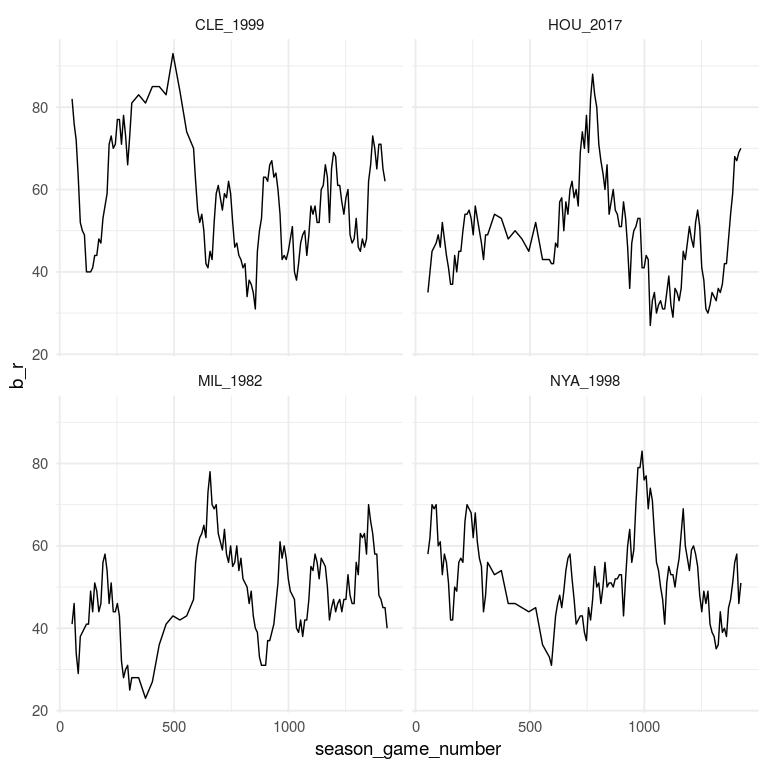

<!-- README.md is generated from README.Rmd. Please edit that file -->
grcdr
=====

This package provides a collection of custom `ggplot2` extensions - `Geoms`, `Stats`, `Coords`, `Themes`, etc. The name `grcdr` is a contraction of *Graphs with Code and Data in R* and is a reference to the [*Graphs with Code and Data*](http://graphswithcodeanddata.xyz/) blog, to which this package is loosely related.

Installation
------------

You can install `grcdr` from github with:

``` r
# install.packages("devtools")
devtools::install_github("bdilday/grcdr")
```

Examples
--------

The below will use `dplyr` and `ggplot2`

``` r
library(grcdr)
## load basics
library(dplyr)
library(ggplot2)

## set the theme
ggplot2::theme_set(theme_minimal(base_size = 14))
```

geom\_excursion
---------------

`geom_excursion` plots running quantities as connected scatter plots. It requires an `x` and `y` aesthetic and also a `t` aesthetic to give the ordering (i.e. "time")

#### MLB runs scored and allowed

Here's some example data provided with the package that gives team-level stats for 4 MLB teams (Cleveland 1999, New York Yankees 1998, Houston Astros 2017, Milwaukee Brewers 1982).

``` r
# load some example data from the package
teams_df = read.csv(system.file("extdata/team_stats.csv", package = "grcdr"),
                    stringsAsFactors = FALSE)
teams_df$game_date = as.Date(teams_df$game_date)
head(teams_df, 2)
#>          k     game_key game_source  game_date game_number site_key
#> 1 CLE_1999 ANA199904060         evt 1999-04-06           0    ANA01
#> 2 CLE_1999 ANA199904070         evt 1999-04-07           0    ANA01
#>   season_phase team_alignment team_key opponent_key r_g r_w r_l r_t b_g
#> 1            R              0      CLE          ANA   1   0   1   0   1
#> 2            R              0      CLE          ANA   1   1   0   0   1
#>   b_pa b_ab b_r b_h b_tb b_2b b_3b b_hr b_hr4 b_rbi b_gw b_bb b_ibb b_so
#> 1   41   36   5  10   16    1    1    1     0     4   NA    4     0    6
#> 2   47   40   9  13   17    4    0    0     0     9   NA    6     0    7
#>   b_gdp b_hp b_sh b_sf b_sb b_cs b_xi b_lob p_g p_gs p_cg p_sho p_csho
#> 1     0    0    1    0    0    0    0     9   1    1    0     0      0
#> 2     1    1    0    0    2    0    0    11   1    1    0     0      0
#>   p_gf p_w p_l p_sv p_out p_tbf p_ab p_r season season_game_number
#> 1    1   0   1    0    24    35   32   6   1999                  1
#> 2    1   1   0    0    27    34   31   1   1999                  2
```

We can plot runs scored (`b_r`) on the x-axis and runs allowed (`p_r`) on the y-axis. The time coordinate is the season game number.

``` r
base_plot = teams_df %>% 
  ggplot() + labs(x="runs scored", y="runs allowed")
```

By default the data aren't averaged (the run length is 1)

``` r
p = base_plot + 
  geom_excursion(aes(x=b_r, y=p_r, t=season_game_number)) + 
  facet_wrap(~k)
print(p)
```


The `run_length` parameter controls how many items get summed. The following uses `run_length = 10`

``` r
p = base_plot + 
  geom_excursion(aes(x=b_r, y=p_r, t=season_game_number), run_length = 10) + 
  facet_wrap(~k)
print(p)
```


##### averages instead of sums

If you give `x_weight` or `y_weight` aesthetics then weighted averages are computed instead of sums. Passing `_weight = 1` therefore results in straight averages.

``` r
p = base_plot + 
  geom_excursion(aes(x=b_r, y=p_r, t=season_game_number, x_weight=1, y_weight=1), run_length = 10) + 
  facet_wrap(~k)
print(p)
```


##### time ordering

Additionally, the time ordering can be changed

``` r
set.seed(101)
random_idx = sample(1:nrow(teams_df), nrow(teams_df))

# order by random
p = teams_df %>% cbind.data.frame(random_idx=random_idx) %>%  
  ggplot() + labs(x="runs scored", y="runs allowed") + 
  geom_excursion(aes(x=b_r, y=p_r, t=random_idx, 
                     x_weight=1, y_weight=1), 
                 run_length = 10) + 
  facet_wrap(~k)
print(p)
```


stat\_run
---------

`stat_run` is a lower-level utility than `geom_excursion`. It can change the `geom` (from `path`) and also can plot running line charts in addition to connected scatterplots.

##### smoothed line charts

Here I set the y aesthetic but not x, which is effectively a line chart.

``` r
p = teams_df %>% ggplot() +
  stat_run(aes(y=b_r, t=season_game_number)) + 
  facet_wrap(~k) + labs(x="game number", y="runs scored")
print(p)
```


However, unlike a traditional line chart, I can average or sum the y variable

``` r
p = teams_df %>% ggplot() +
  stat_run(aes(y=b_r, t=season_game_number), run_length = 10) + 
  facet_wrap(~k) + labs(x="game number", y="runs scored")
print(p)
```


The default is to generate running totals by using the cumulative sum function and taking differences. A different cumuklative aggregation function can be specified, however. Note that following is for illustration and that the run\_fun doesn't correspond to any particularly useful quantity(that I'm aware of, anyway).

``` r
fun_with_cumsum_fun = function(x) {
  cumsum(x * (x - 1) * sin(x / 5 * pi))
}

p = teams_df %>% ggplot() +
  stat_run(aes(y=p_r, t=season_game_number), 
           run_length = 10,
           y_run_fun = fun_with_cumsum_fun) + 
  facet_wrap(~k) + labs(x="game number", y="runs scored")
print(p)
```


##### reproducing a geom\_excursion

Setting the `x` aesthetic reproduces a `geom_excursion`

``` r
p = teams_df %>% ggplot() +
  stat_run(aes(x=b_r, y=p_r, t=season_game_number), run_length = 10) + 
  facet_wrap(~k) + labs(x="runs scored", y="runs allowed")
print(p)
```


##### fill missing values

If the time coordinate is missing values, we can fill in the corresponding x and y.

``` r
censored_df = teams_df %>% filter(season_game_number < 40 | season_game_number >60) 
p = censored_df %>% 
  ggplot() + 
  stat_run(aes(y=b_r, t=season_game_number, x=season_game_number)) + facet_wrap(~k)
print(p)
```


``` r

p = censored_df %>% 
  ggplot() + 
  stat_run(aes(y=b_r, t=season_game_number, x=season_game_number), 
           run_length = 10)  + 
  facet_wrap(~k)
print(p)
```



``` r

p = censored_df %>% 
  ggplot() + 
  stat_run(aes(y=b_r, t=season_game_number, x=season_game_number), 
           run_length = 10, y_run_fill_value = 20, x_run_fill_value = 50) + 
   facet_wrap(~k)
print(p)
```


##### other geoms

The `geom_excursion` layer forces a `path` `Geom`, but the lower-level `stat_run` layer can change the `Geom`. For example it can use `polygon` (although unclear what the interpretation is)

``` r
p = teams_df %>% 
  ggplot() + 
  stat_run(aes(x=b_r, y=p_r, t=game_date), geom='polygon') + 
  facet_wrap(~k)
print(p)
```


